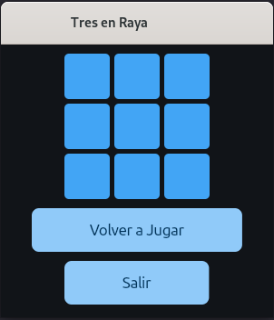
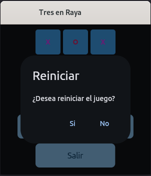
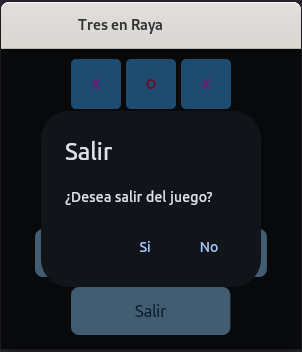
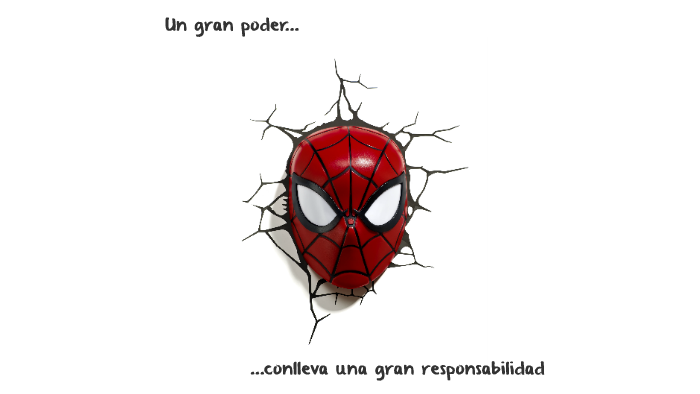

# Tres en Raya

## Capturas de Pantalla

* Objetivo
* Herramientas
* Instalación
* Conclusión

---
## Objetivo
El objetivo de este respositorio es subir mis prácticas, en este caso utilizando cómo lenguaje de programación **Python**.
Después de investigar e ir comparando código, fuí desarrollando de a poco esta app. La misma es con fines educativos, no soy responsable por el uso que se le de a la misma.
En este caso es el juego _Tres en Raya_, está pensado para 2 jugadores que se van turnando para hacer su movida y marcar en el tablero su elección. El primer jugador que haga una línea vertical u horizontal con su signo es el ganador.

## Herramientas
* flet
* pillow

## Instalación
~~~
$ pip install -r requirements.txt

$ python3 main.py
~~~

## Conclusión
